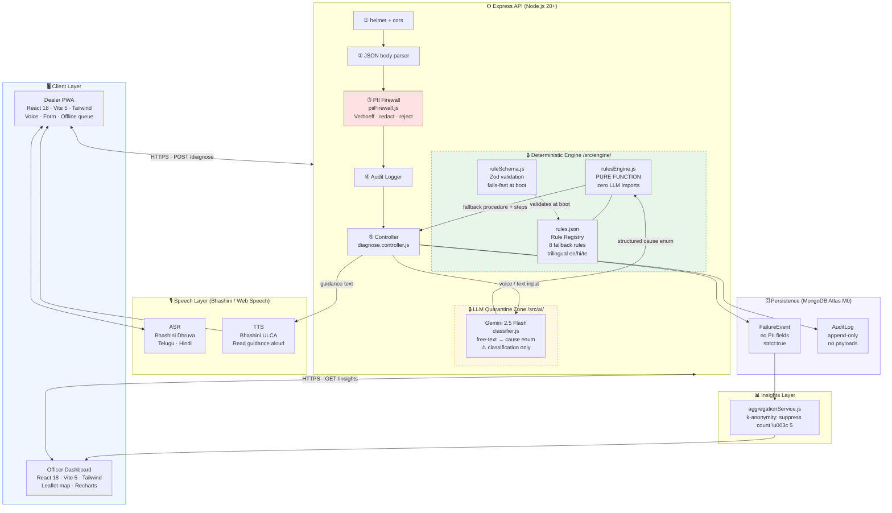

# Setu (सेतु)

> **Prototype — Synthetic Data Only. No live UIDAI/ePoS integration.**

Setu bridges the "last inch" between an eligible beneficiary and their PDS entitlement. When Aadhaar-based authentication fails at a Fair Price Shop, FPS dealers are often left without clear guidance. Setu diagnoses the likely cause of failure, looks up the applicable documented fallback procedure from a verified rule registry, and explains the next steps to the dealer in simple, multilingual language — keeping the human dealer firmly in control throughout.

Built for **Kalachakra 2K26 — Digital Public Services Track**, Problem Statement **PS-D02: "The Last Inch"**.

---

## Architecture Overview



**Key invariants enforced by the diagram:**

| Invariant | Where | What it means |
|---|---|---|
| **I1** — LLM never decides | `rulesEngine.js` (zero LLM imports) | Gemini only classifies input; the engine owns the decision |
| **I2** — No raw PII | `piiFirewall.js` position ③ | Verhoeff-gated Aadhaar rejection; phone/email/PAN redaction |
| **I3** — Every result cites the registry | `rules.json` + response shape | `ruleId`, `citation`, `verificationStatus` in every response |
| **I4** — Human in the loop | No approval endpoints | UI says "Suggested next step" — dealer decides |
| **I5** — No live UIDAI/ePoS | Synthetic data only | `SYNTHETIC DATA` badge always visible |
| **I6** — k-anonymity | `aggregationService.js` | Map suppresses buckets where count < 5 |

The **deterministic rule engine is the sole authority** for fallback decisions. The LLM is limited to classifying free-form input and rephrasing existing rule steps — it cannot determine entitlement, eligibility, fallback procedures, or government policy.

---

## Monorepo Structure

```
setu/
├── apps/
│   ├── dealer-pwa/           # FPS Dealer PWA (React 18 + Vite 5)
│   └── officer-dashboard/    # Officer Analytics Dashboard (React 18 + Vite 5)
├── services/
│   └── api/                  # Express API (Node.js 20+)
├── packages/
│   └── shared/               # Shared constants & cause taxonomy
├── tests/
│   └── e2e/                  # Playwright end-to-end tests
├── docs/                     # Project memory & documentation
├── .env.example
└── package.json              # npm workspaces root
```

---

## Prerequisites

- **Node.js** >= 20
- **npm** >= 10
- **MongoDB Atlas** M0 cluster (free tier) — connection string required in `.env`

---

## Installation

```bash
# Clone the repository
git clone <repo-url>
cd setu

# Install all workspace dependencies
npm install
```

---

## Development

```bash
# Start all services concurrently
npm run dev

# Start individual services
npm run dev:dealer       # Dealer PWA       → http://localhost:5173
npm run dev:dashboard    # Officer Dashboard → http://localhost:5174
npm run dev:api          # Express API       → http://localhost:3001

# Production builds
npm run build
```

---

## Environment Variables

Copy `.env.example` to `.env` and fill in the required values:

```bash
cp .env.example .env
```

| Variable           | Description                                    | Required      |
|--------------------|------------------------------------------------|---------------|
| `NODE_ENV`         | `development` or `production`                  | Yes           |
| `PORT`             | API server port (default: `3001`)              | No            |
| `MONGODB_URI`      | MongoDB Atlas connection string                | Yes (API)     |
| `GEMINI_API_KEY`   | Google Gemini API key (classification only)    | P1            |
| `BHASHINI_API_KEY` | Bhashini API key (ASR/TTS/NMT)                 | P1            |
| `BHASHINI_USER_ID` | Bhashini user ID                               | P1            |
| `HMAC_SECRET`      | Secret for server-generated pseudonymous refs  | P1            |

> **Never commit a populated `.env` file. Only `.env.example` is tracked by Git.**

---

## Health Check

```bash
curl http://localhost:3001/api/v1/health
# → { "status": "ok", "service": "setu-api" }
```

---

## Current Implementation Status

| Module | Status | Notes |
|---|---|---|
| Architecture freeze | ✅ Complete | `ARCHITECTURE.md` v1.0 frozen |
| Monorepo scaffold | ✅ Complete | API, Dealer PWA, Officer Dashboard all build |
| Rule Registry | ✅ Complete | 8 rules, Zod-validated at boot |
| Deterministic rule engine | ✅ Complete | Pure function, 8-level precedence, 14/14 tests pass |
| PII Firewall | ✅ Complete | Verhoeff + redaction + forbidden keys, 15/15 tests pass |
| Form diagnosis endpoint | 🔲 Not started | `POST /api/v1/diagnose/form` |
| Mongoose models | 🔲 Not started | `FailureEvent`, `AuditLog` |
| Gemini classifier | 🔲 Not started | `/src/ai/classifier.js` |
| Bhashini integration | 🔲 Not started | ASR + TTS |
| Dealer PWA (diagnosis UI) | 🔲 Not started | |
| Officer Dashboard (analytics) | 🔲 Not started | |
| Voice fallback | 🔲 Not started | |
| E2E tests | 🔲 Not started | |
| Deployment | 🔲 Not started | Vercel + Render |

---

## Safety Principles

1. **No real Aadhaar numbers** — never collected, stored, or transmitted.
2. **No real biometric data** — never processed or stored.
3. **No live UIDAI or ePoS integration** — all flows use synthetic data.
4. **No PII persistence** — raw audio, transcripts, names, addresses, and phone numbers are never persisted.
5. **LLM never decides fallback** — the deterministic rule engine is the sole authority.
6. **No fabricated government rules** — unverified rules are marked `RULE_REQUIRES_VERIFICATION`.
7. **No automated entitlement decisions** — the human dealer remains in control.
8. **Geographic k-anonymity** — dashboard map suppresses any bucket where count < 5.
9. **Human-in-the-loop** — every recommendation is an instruction to a dealer, not a system action.

---

## Synthetic Data

**All transaction and demonstration data in this prototype is entirely synthetic.**

Synthetic identifiers follow the format:

| Type         | Example          |
|--------------|------------------|
| Beneficiary  | `BEN-SYN-001`    |
| Fair Price Shop | `FPS-SYN-001` |
| District     | `DIST-SYN-001`   |
| Event        | `EVT-SYN-001`    |

No real beneficiary, dealer, or citizen data is used anywhere in this project.

---

## LLM Usage Boundaries

The Gemini model is used **only** for:
- Classifying free-form dealer input into a structured cause enum.
- Rephrasing existing verified rule steps for clarity.

The Gemini model is **explicitly prohibited** from:
- Deciding which fallback procedure applies.
- Determining entitlement or eligibility.
- Approving or denying any government action.
- Generating government policy or rules.

> The deterministic rule engine (`services/api/src/engine/rulesEngine.js`) contains **zero** LLM imports.

---

## Contributing

This is a hackathon prototype under active development. See [`docs/BUILD_STATUS.md`](docs/BUILD_STATUS.md) for the current task queue and [`docs/DECISIONS.md`](docs/DECISIONS.md) for all architectural decision records.
